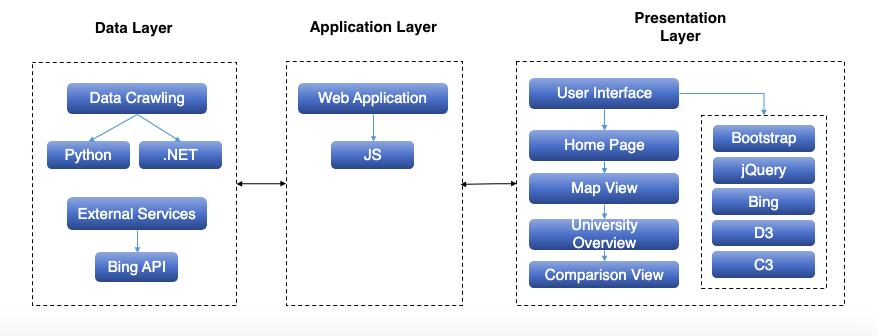
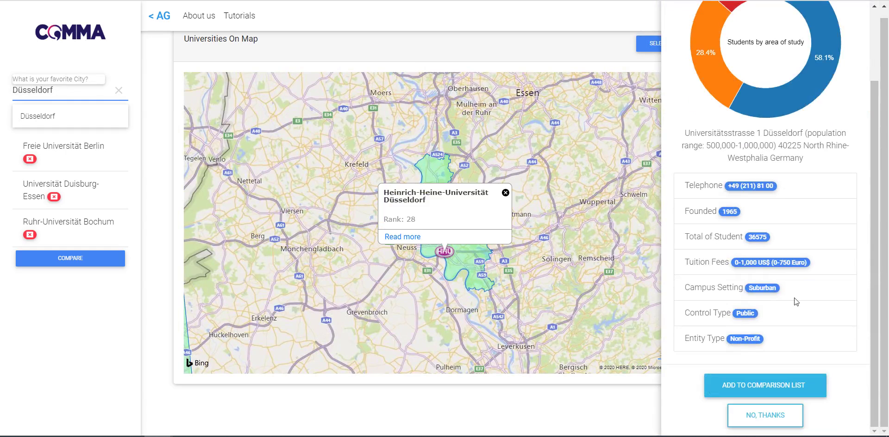
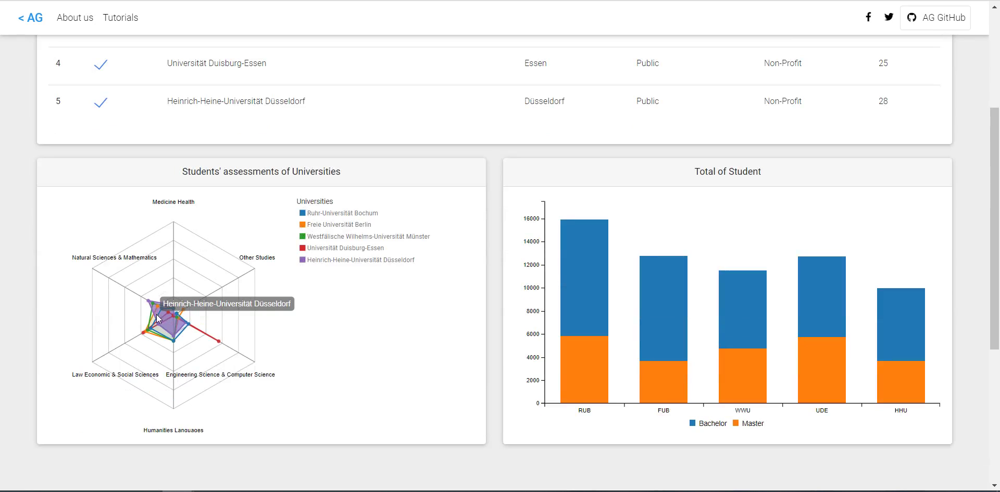

# Table of content 
- [Apply Germany(COMMA Group)](#headers)
- [Dataset Description](#headers1)
- [Project Architecture](#headers2)
- [Implementation Technologies](#headers3)
- [To deploy the project](#headers4)
- [Contributors](#headers5)

<a name="headers"/>  

 

# ApplyGermany (Comma Group)
Germany is highly popular among international students. This is mainly because of the country's many excellent universities, its dynamic student life and good funding options. If you have decided to come to Germany, our platform can help you to choose a proper university through visual comparisons.
Fill out the information form and click on "Find Uni" to find your desired university using a map. Compare the Universities with the help of charts.

Deployed Version: <a href="http://applygermany.byethost16.com/">Live Demo</a>
 
Youtube Video: <a href="https://youtu.be/nDY0AahGktQ">Demo On Youtube</a>    
 

<a name="headers1"/> 

# Dataset from sites: 
  <a href="https://www.4icu.org/">https://www.4icu.org/</a>   
   
<a href="https://ranking.zeit.de/che/de/">https://ranking.zeit.de/che/de/</a>   
   

<a name="headers2"/>  

# Project Architecture:

 

<a name="headers3"/>

# Implementation Technologies:
This project is based on the following technologies:

* Front-End
  + Website
    + Javascript,Jquery
    + CSS,MDBootstrap
    + HTML
  + Visualisation
    + C3
    + D3
* Providing Data
  + .Net
  + Python
   

<a name="headers4"/>

# To deploy the project:
How to deploy the project locally:

  1. clone the repository
  2. install node.js from https://nodejs.org/en/
  3. run npm install in the terminal from the project directory
  4. run npm start in the terminal from the project directory
  5. got to http://localhost:8080/
 

#  Project Screenshots:

 

<a name="headers5"/>

#  Contributors:
•	Hoda Ghanbarzadeh: Master student of Applied Computer Science at the University of Duisburg-Essen.  E-mail: Hoda.Ghanbarzadeh@stud.uni-due.de.
 
•	Parastoo Amirali:  Master student of Intelligent Networks at the University of Duisburg-Essen.  E-mail: Parastoo.Amirali@stud.uni-due.de.
